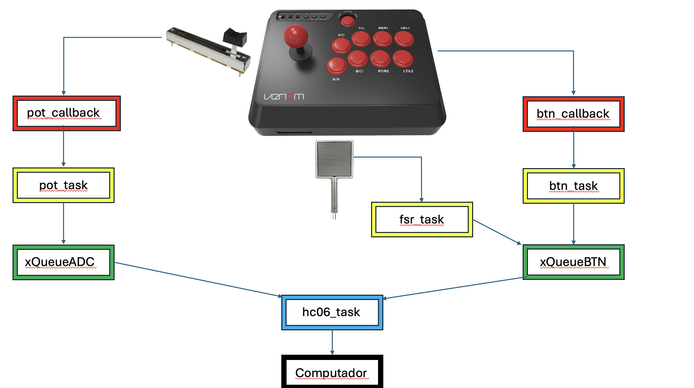

# RP2040 freertos with OLED1

# Sistema Embarcado para Arcade Stick

Este projeto implementa um sistema embarcado para um arcade stick, baseado no microcontrolador RP2040 com FreeRTOS. O sistema utiliza botões digitais, um sensor FSR e um potenciômetro linear, com comunicação via Bluetooth (HC-06) para simular entradas de controle em um PC ou console. É ideal para jogos retrô ou interfaces customizadas.

## Diagrama de Fluxo

O sistema embarcado segue o fluxo descrito no diagrama abaixo:

### 1. **Botões Digitais**
   - Até 12 botões são monitorados pela tarefa `button_task`. Quando um botão é pressionado ou liberado, a informação é colocada em uma fila (`xQueueInput`).

### 2. **Sensor FSR (Force-Sensing Resistor)**
   - O controle analógico (X/Y) é monitorado por outra tarefa chamada `analog_task`. Quando o analógico é movido, os dados de posição são enviados para uma fila (`xQueueAnalog`).

### 3. **Potenciômetro Linear**
   - Um potenciômetro linear é usado para controle analógico, como ajuste de volume. A tarefa `pot_task` lê o valor suavizado e envia somente quando há variação significativa.

### 4. **Tarefa Bluetooth (hc06_task)**
   - As filas `xQueueBTN` (botões e FSR) e `xQueueADC` (potenciômetro) são lidas pela `hc06_task`, que transmite os dados via UART para o módulo HC-06.

### 5. **Módulo Bluetooth HC-06**
   - O HC-06 envia os comandos via Bluetooth para um script Python ou aplicação no PC/console, que interpreta os dados e os converte em ações no sistema.

### 6. **Feedback Visual (Opcional)**
   - Feedback visual e sonoro pode ser adicionado, como LEDs piscando ou buzzer emitindo sons, para confirmar as ações ou informar o estado do dispositivo.

## Requisitos
- Microcontrolador compatível com FreeRTOS.
- Módulo Bluetooth HC-06.
- Sensor FSR.
- Potenciômetro linear.
- Fonte de alimentação estável e conexão UART.

### Explicações adicionais:
- **Modularidade:** O sistema pode ser expandido com novos sensores ou modos de controle facilmente, graças à estrutura baseada em tarefas e filas do FreeRTOS.
- **Compatibilidade:** O projeto foi pensado para facilitar a integração com scripts Python que interpretam os dados recebidos via Bluetooth como comandos do teclado ou controle.

